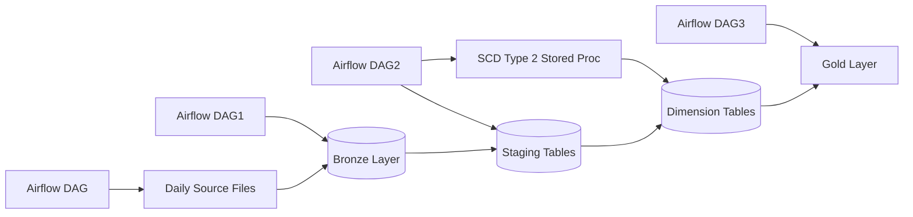
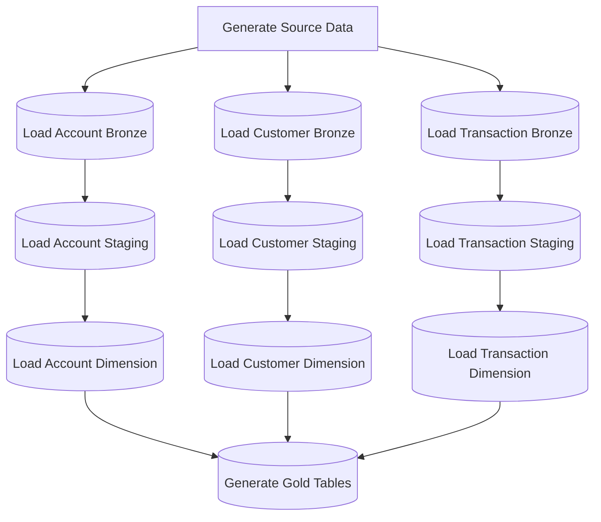
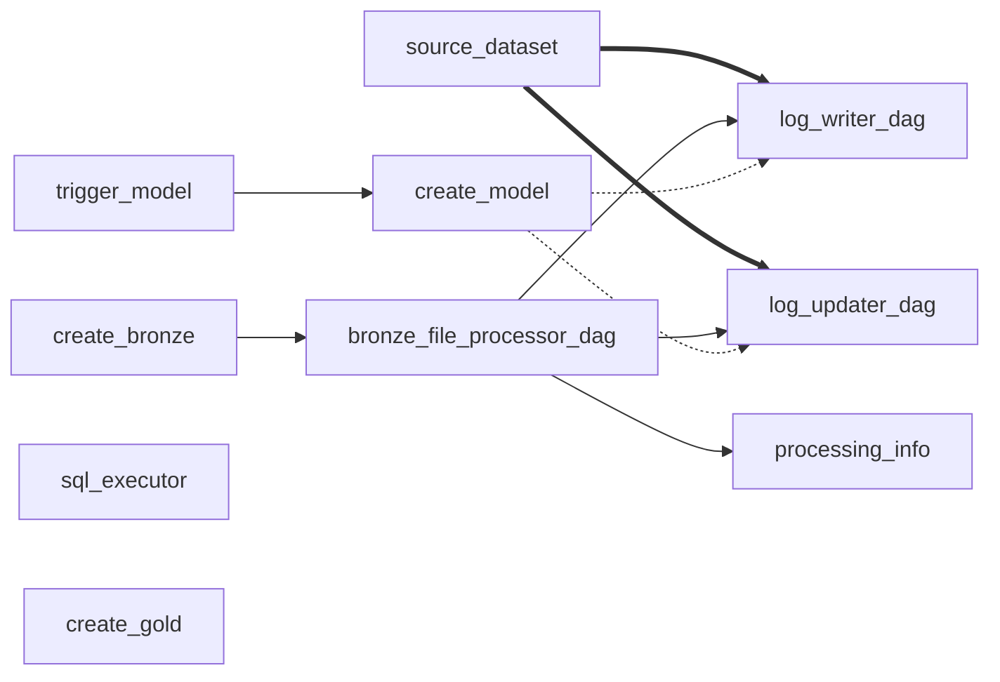
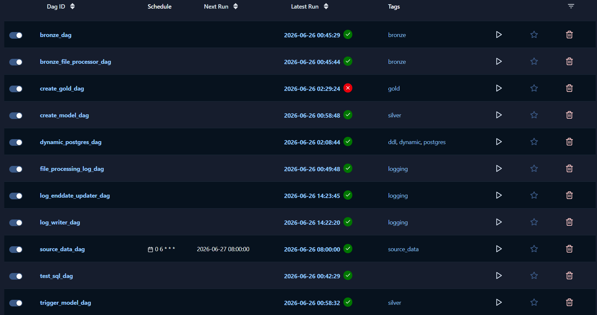
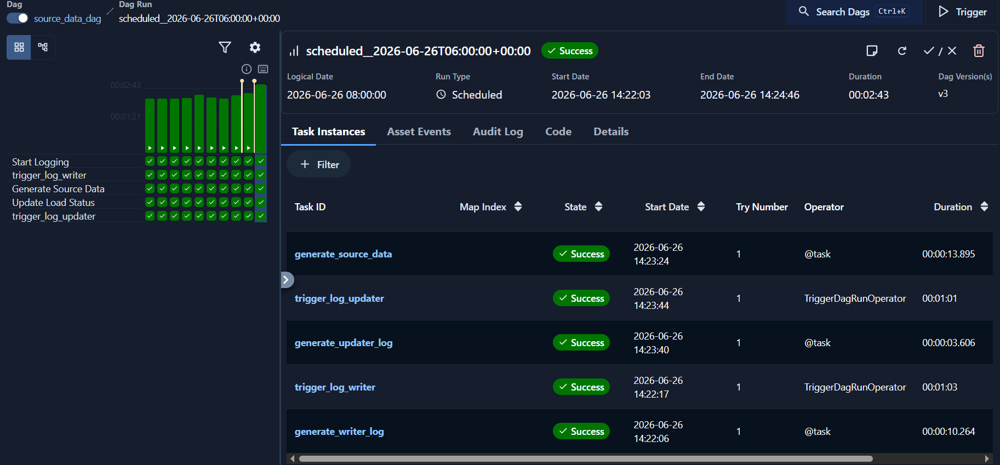
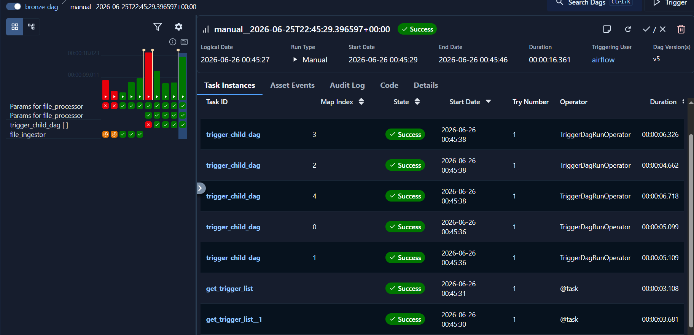
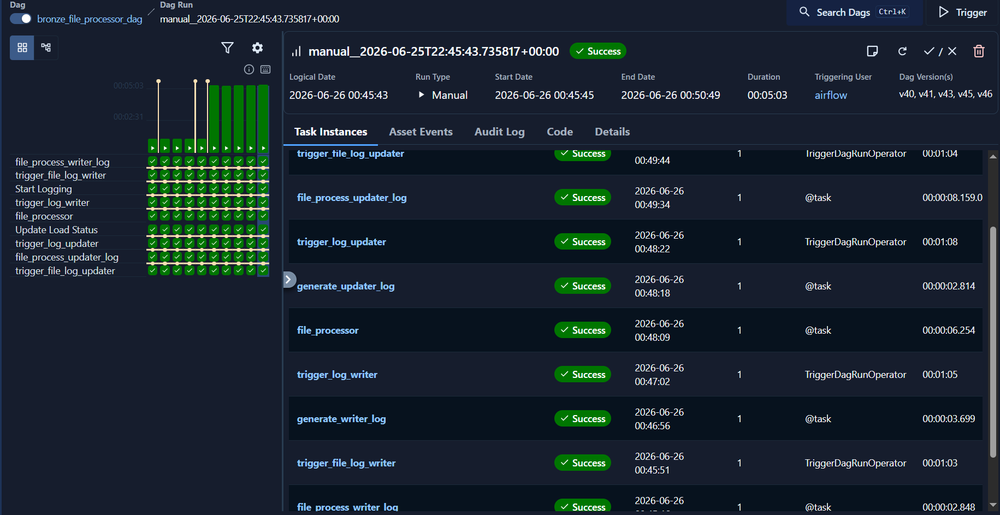
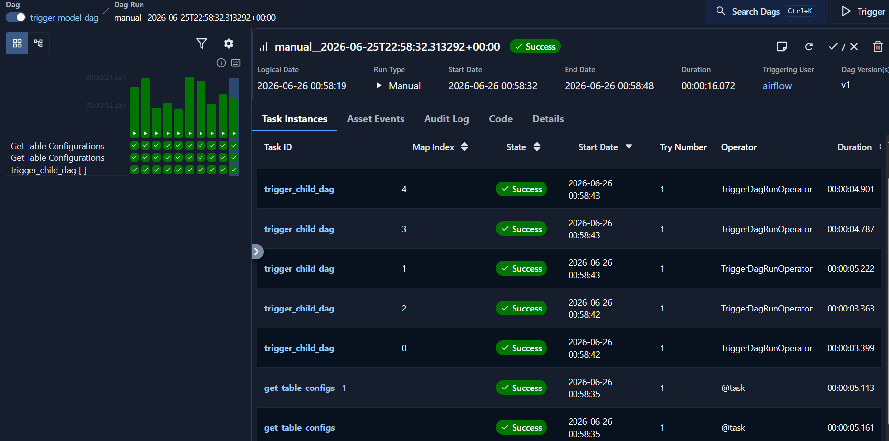
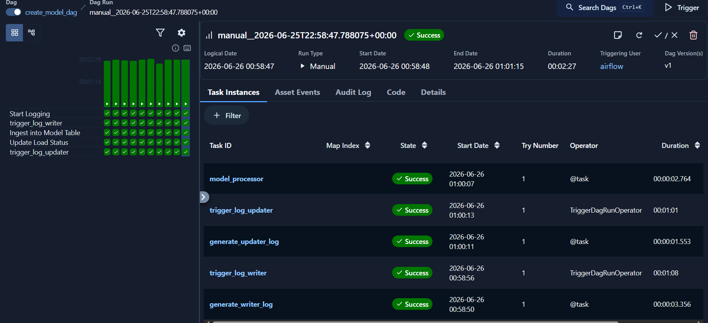
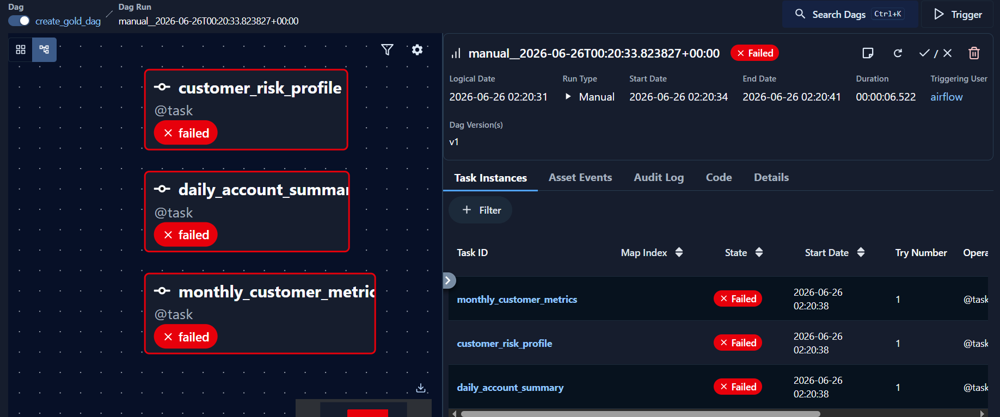

# 🚀 Metadata-Driven ETL Pipeline using Apache Airflow & PostgreSQL


A complete **production-grade ETL pipeline** using **Apache Airflow**, **PostgreSQL**, and **SCD Type 2** implementation.

This project demonstrates advanced Data Engineering skills in building scalable, maintainable, and reliable data pipelines.

---

## 🎯 Project Overview

This system automates the daily ingestion and historization of banking transaction data.


## 🏛️ Data Architecture (Medallion Architecture)

This project follows the **Medallion Architecture** (Bronze → Silver → Gold):

- **Bronze Layer**: Raw source data (Parquet files)
- **Silver Layer**: Cleaned, validated, and historized data (SCD Type 2 dimensions)
- **Gold Layer**: Aggregated, business-ready, and consumption-ready tables optimized for analytics, reporting, and alerting

This layered approach ensures **data quality**, **traceability**, and **high performance** for downstream consumers (BI tools, ML models, investigators).

### Key Features

- Daily source data generation with realistic patterns
- Parameterized and reusable Airflow DAGs
- Robust SCD Type 2 implementation using Stored Procedures
- Hash-based change detection (`hash_pk` + `hash_diff`)
- Dynamic multi-table processing
- Proper error handling and logging
- Production-ready folder structure

---

## 🛠️ Tech Stack

- **Orchestration**: Apache Airflow (TaskFlow API)
- **Database**: PostgreSQL 15+
- **Language**: Python 3.11+
- **Data Format**: Parquet
- **Connection**: psycopg2 + PostgresHook

---

## 📁 Project Structure

```bash
Airflow_ETL_Project/
├── dags/
│   ├── dag1.py
│   ├── dag2.py
│   ├── dag3.py
│   └── dag4.py
├── source_queries/
│   ├── schema_creation.txt
│   ├── sp_creation_txt
│   └── table_creation.txt
├── data/
│   └── tm_source_data/
│       └── <date>/
├── config/
├── logs/
├── docker-compose.yml
├── .env
└── README.md
```


## Core Components

1. Daily Source Data Generation
    - Generates realistic customer, account, and transaction data
    - Supports date-specific runs


2. SCD Type 2 Implementation
    
    Stored Procedure: scd2_upsert()

    Features:
    - hash_pk → Unique record identification
    - hash_diff → Change detection on attributes
    - Automatic expiration of previous versions (rec_end, is_active)
    - Idempotent design (safe to rerun)


3. Airflow DAGs
    Key Airflow Features Used:
    - Dynamic Task Mapping
    - Parameter passing between DAGs
    - TriggerDagRunOperator
    - Runtime configuration via params
    - Proper task dependencies and branching


## Data Flow

The flowchart LR using **mermaid**



The dataflow graph TD using **mermaid**



## DAG Usage FlowChart:




## DAG Description



**sql_executor:**

This dag takes a parameter input sql query and executes using psycopg2. The query is executed on the postgres database.


**source_dataset:**

This is a **metadata driven** dag **scheduled** to run daily at 06:00 UTC. This generates the source file in data/tm_source_data/<metadata_date>.



**create_bronze:**

This dag is used to run child dag *bronze_file_processor_dag* for multiple files using the parameters generated. It fetches the dates of the files to be processed from a metadata table and creates the **parameters** to call the child dag. It makes sure that the file is not re-processed by checking the file status from *processing_info* dag.



**bronze_file_processor_dag**

This dag takes id, filepath and filename as **input parameters** and loads data into bronze layer tables. Table names are derived from filenames. It also logs the information of the loads, such as whether the file has been processed and what is the status of the load of particular bronze tables. To log this it calls the child pipelines *processing_info*, *log_writer_dag*, *log_updater_dag*.



**trigger_model:**

This dag takes run_date as input parameter and calls the pipeline *create_model_dag* for the multiple model tables by passing the parameters. These parameters are currently hardcoded within the dag, but can be provided in a metadata table and fetched to make it more metadata driven.



**create_model:**

This model takes *id*,*date*,*staging_table*,*target_table*,*pk_columns*,*non_pk_columns*, as input and create staging tables --> Load silver layer tables in historization type 2 manner and logs using *log_writer_dag*, *log_updater_dag*.



**create_gold:**

This model creates the gold layer tables by executing SQL queries.



## How to Run

1. Download Docker from official docker website.

2. Copy `docker-compose.yml` from the project in the root directory.

```bash
# Using official docker-compose
docker-compose up -d
```

3. Create Postgres Connection
Go to Airflow UI → Admin → Connections → Create new connection:
- Conn ID: postgres_default
- Conn Type: Postgres
- Host: postgres (or your host)
- Schema: public / staging

Database name, username and password are provided in the `docker-compose.yml` 

4. Run postgres in terminal

```bash
docker exec -it <postgres_container_full_name> psql -U airflow -d airflow
```

5. Deploy DAGs
Copy DAG files to dags/ folder inside root directory. 

6. Create tables and stored procedures from the scripts in source_queries folder.


## Key Learnings & Skills Demonstrated

Airflow Expertise
- TaskFlow API (@dag, @task)
- Dynamic Task Mapping (.partial().expand())
- Cross-DAG triggering with parameters
- Context handling and XCom usage
- Runtime parameterization
- Proper error handling and retries

## Data Engineering Best Practices
- SCD Type 2 with hash-based change detection
- Idempotent pipelines
- Comprehensive logging using RAISE NOTICE
- Schema management and dynamic SQL
- Production-ready folder structure

## PostgreSQL Advanced Concepts
- Stored Procedures with dynamic SQL
- Proper escaping and format()
- Array parameters
- Performance optimization using hashes

## Future Enhancements (Roadmap)

- Data Quality checks using Great Expectations
- Incremental loading with watermark
- DBT integration for transformations
- Backfill capability

## Skills Showcase
This project demonstrates ability to:
- Design and implement enterprise-grade ETL pipelines
- Master Apache Airflow orchestration patterns
- Implement SCD Type 2 patterns correctly
- Write clean, maintainable, and production-ready code
- Integrate Python and PostgreSQL effectively
- Build self-documenting and reusable frameworks


## 📄 License

This project is open-sourced under the **MIT License** - see the [LICENSE](LICENSE) file for details.

